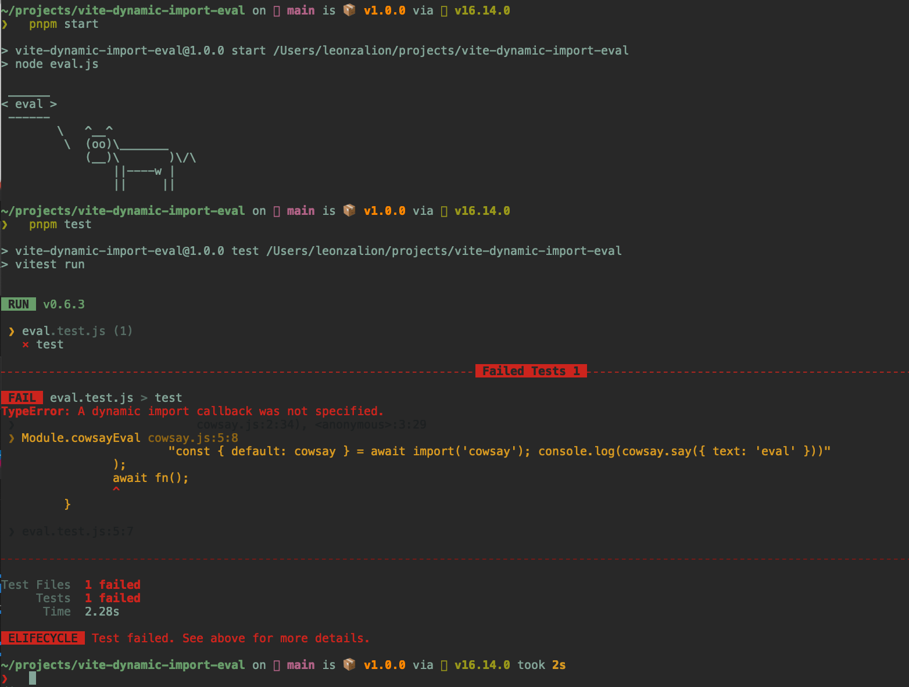

# Vitest dynamic import error

Running `arrayUniqEval` from `eval.js` using regular Node works fine, but when running it from Vitest, the following error appears:

It looks like Vitest doesn't support the dynamic import when using `eval` or `new Function()`. Perhaps it's related to this error?: https://github.com/nodejs/node/issues/30591
